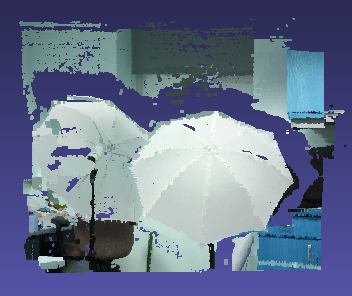

# Stereo_Reconstruction
Aimed to Reconstruct 3D image from stereo image pairs.  
## Algorithm
1. Compute calibration matrix, distortion coefficients, and baseline vector camera. [Calibration code](https://github.com/pareespathak/visual_odometry/tree/main/calibration) 
2. Compute Disparity map from Two images. 
3. From the disparity map and baseline calibration matrix, obtain a dense 3D point cloud.
4. Visualize results using [MeshLab](https://www.meshlab.net/) software.

## How to use 
`git clone https://github.com/pareespathak/Stereo_Reconstruction.git`  
`pip3 install -r requirements.txt`  
`python stereo_reconstruction.py`  
> Before excecuting  
> 1. Edit Path of image pairs.  
> 2. Edit calibration matrix of cameras and other parameters.  
> 3. Edit file name for saving outputs. (.ply file)

## Results 
### Bike 
Left Image  | Right Image  
-----------------------------------------|-------------------------------------------
Reconstructed Images  | Disparity Map  

### Umbrella 
Left Image  | Right Image 
-----------------------------------------------------|-------------------------------------
Reconstructed Images  | Disparity Map  

